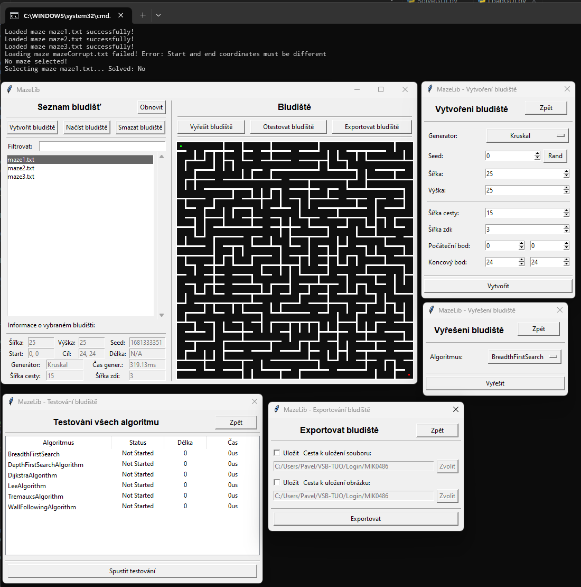

# Project for SKJ (Maze Generator / Solver GUI)

## Project topic
The project utilizes a library created in CPP with Python bindings. [The library can be found here.](https://github.com/Firestone82/MazeLib)
This GUI fully utilizes the library and its functions, allowing for maze generation, solving, rendering, and testing.
GUI is written in Python 3.8 with tkinter. The library is written in C++17.

## Link to the main repository
 - https://github.com/Firestone82/MazeLib

## Requirements
 - Python 3.8
 - tkinter
 - mazeLib 1.0

## GUI Showcase

---
### Project author: Pavel Mikula (MIK0486)
- Took approximately 22 hours 30 minutes