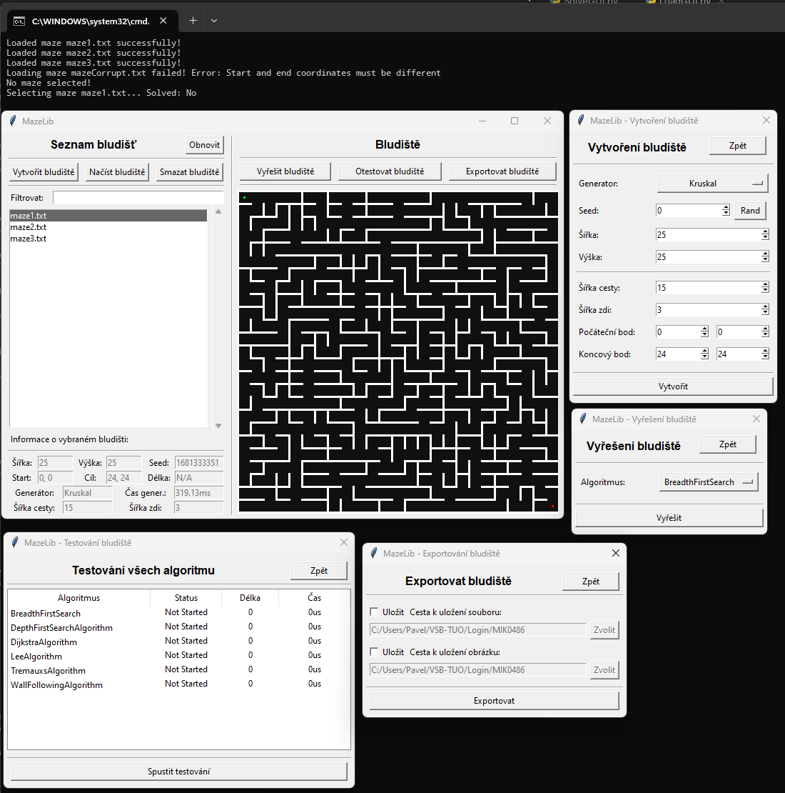

# MazeLib-GUI

> **VŠB-TUO** — School project · Scripting Languages (SKJ)

 

A Python/tkinter graphical interface for the [MazeLib](https://github.com/Firestone82/MazeLib) C++ library. Allows users to generate, solve, and visualize mazes and run algorithm benchmarks — all without using the command line.

<p align="center">
  
</p>

## Features

- Maze generation via all MazeLib generation algorithms
- Maze solving via all MazeLib solving algorithms
- Visual rendering of generated and solved mazes
- Algorithm benchmark view

## Requirements

- Python 3.8+
- tkinter
- MazeLib 1.0 (C++ library with Python bindings — see [MazeLib](https://github.com/Firestone82/MazeLib))

## Setup

1. Build and install MazeLib with Python bindings first:
   ```
   See https://github.com/Firestone82/MazeLib
   ```

2. Clone this repository:
   ```bash
   git clone https://github.com/Firestone82/MazeLib-GUI.git
   cd MazeLib-GUI
   ```

3. Install Python dependencies:
   ```bash
   pip install -r requirements.txt
   ```

4. Run the GUI:
   ```bash
   python main.py
   ```

## License

This project was created as a school assignment at VŠB-TUO.
